# Exploratory Data Analysis Report
Generated on 2025-04-28 23:53:42

## 1. Data Overview
- Number of rows: 29582
- Number of columns: 12
### 1.1 Column Types and Missing Values
                              dtype  missing
person_age                    int64        0
person_income                 int64        0
person_home_ownership        object        0
person_emp_length           float64        0
loan_intent                  object        0
loan_grade                   object        0
loan_amnt                     int64        0
loan_int_rate               float64        0
loan_status                   int64        0
loan_percent_income         float64        0
cb_person_default_on_file    object        0
cb_person_cred_hist_length    int64        0
## 2. Missing Value Analysis
Percentage missing per column:
                            percent_missing
person_age                              0.0
person_income                           0.0
person_home_ownership                   0.0
person_emp_length                       0.0
loan_intent                             0.0
loan_grade                              0.0
loan_amnt                               0.0
loan_int_rate                           0.0
loan_status                             0.0
loan_percent_income                     0.0
cb_person_default_on_file               0.0
cb_person_cred_hist_length              0.0
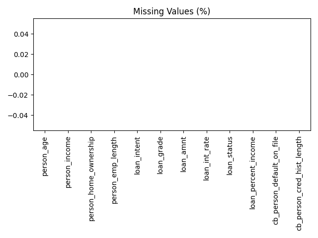
## 3. Descriptive Statistics (Numeric Features)
                              count          mean           std          min       25%           50%           75%        max
person_age                  29582.0     27.580556      6.146146    20.000000     23.00     26.000000     30.000000      94.00
person_income               29582.0  57396.039382  26867.449654  4000.000000  37000.00  52700.000000  73000.000000  140004.00
person_emp_length           29582.0      4.637888      3.879002     0.000000      2.00      4.000000      7.000000      41.00
loan_amnt                   29582.0   8522.271145   4904.926804   500.000000   5000.00   7600.000000  12000.000000   22500.00
loan_int_rate               29582.0     10.926903      3.052518     5.420000      8.00     10.990000     13.060000      23.22
loan_status                 29582.0      0.215604      0.411248     0.000000      0.00      0.000000      0.000000       1.00
loan_percent_income         29582.0      0.167861      0.102461     0.007375      0.09      0.147059      0.222222       0.83
cb_person_cred_hist_length  29582.0      5.722162      4.003495     2.000000      3.00      4.000000      8.000000      30.00
## 4. Categorical Feature Distribution
### person_home_ownership
                       count
person_home_ownership       
RENT                   15527
MORTGAGE               11607
OWN                     2353
OTHER                     95
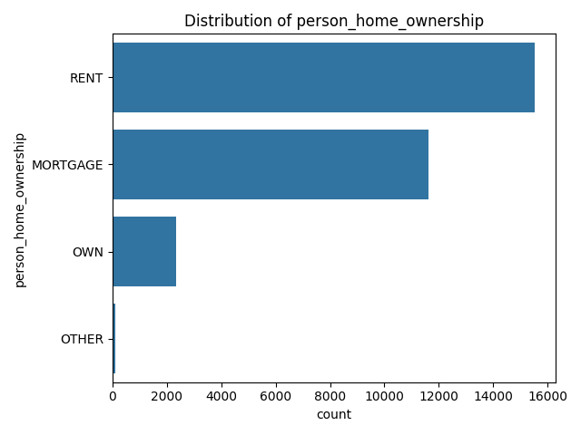
### loan_intent
                   count
loan_intent             
EDUCATION           5899
MEDICAL             5581
VENTURE             5188
PERSONAL            5004
DEBTCONSOLIDATION   4710
HOMEIMPROVEMENT     3200
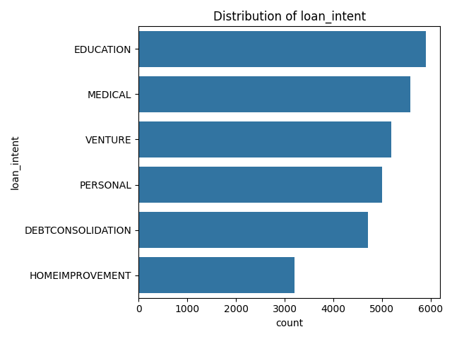
### loan_grade
            count
loan_grade       
A           10075
B            9351
C            6006
D            3137
E             804
F             171
G              38
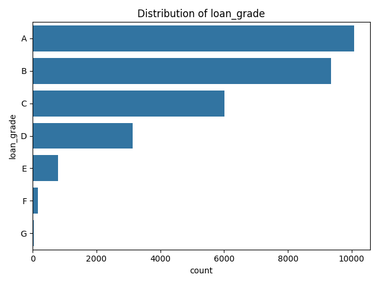
### cb_person_default_on_file
                           count
cb_person_default_on_file       
N                          24443
Y                           5139
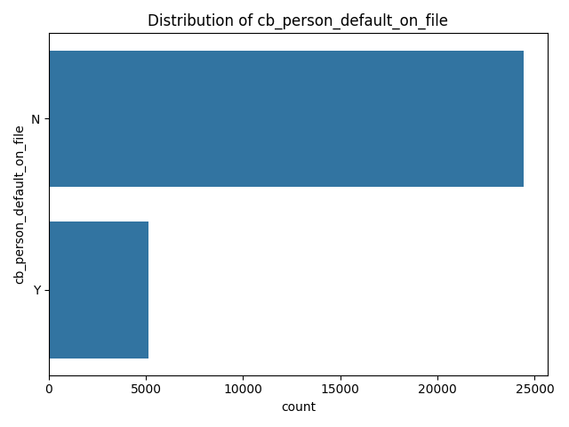
## 5. Target Variable (loan_status) Analysis
Distribution of `loan_status`:
               percent
loan_status           
0            78.439592
1            21.560408
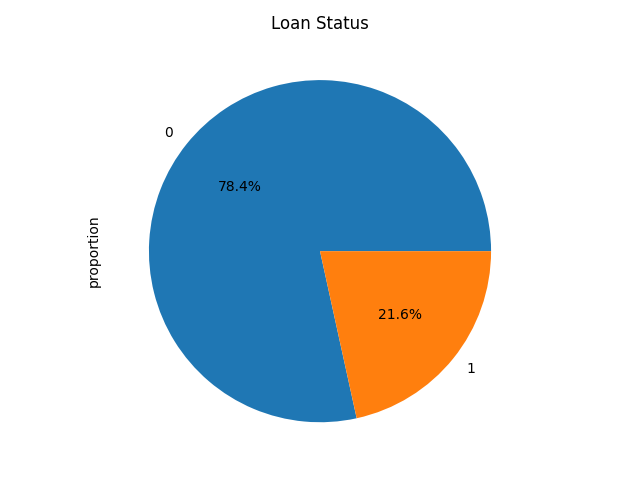
## 6. Feature vs Target Relationships
### person_age by loan_status
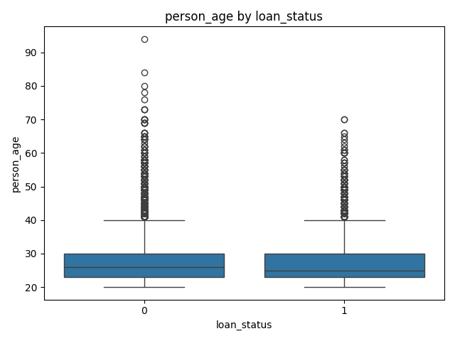
### person_income by loan_status
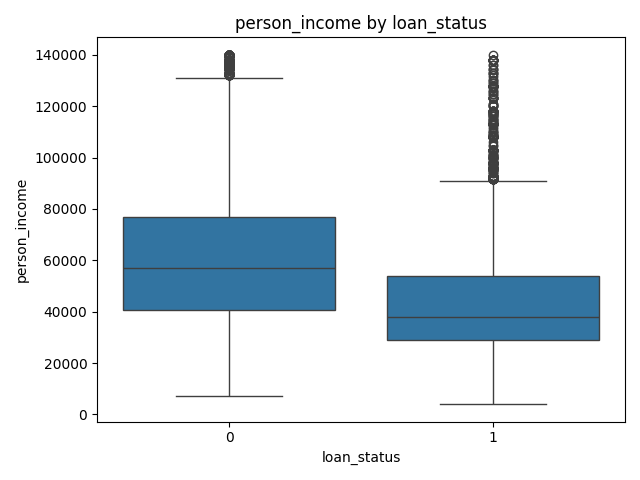
### person_emp_length by loan_status
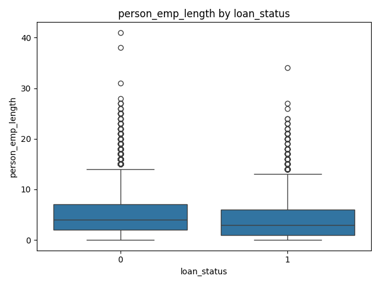
### loan_amnt by loan_status
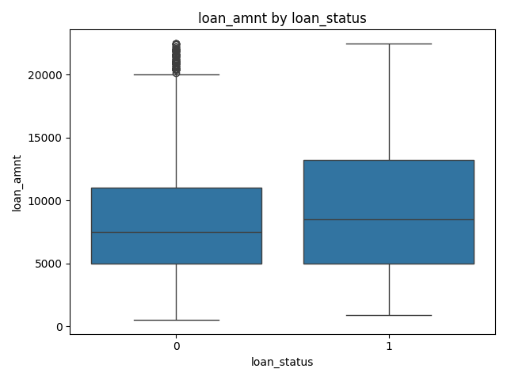
### loan_int_rate by loan_status
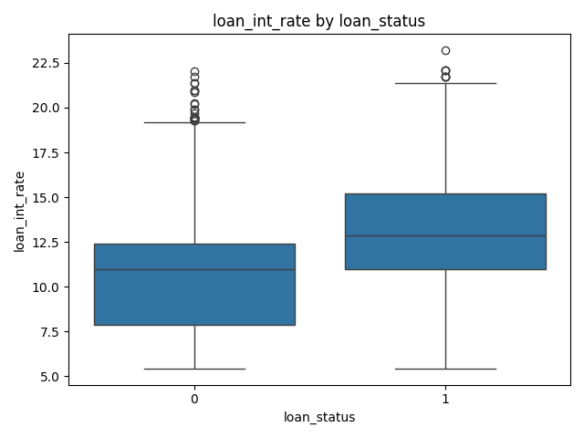
### loan_percent_income by loan_status
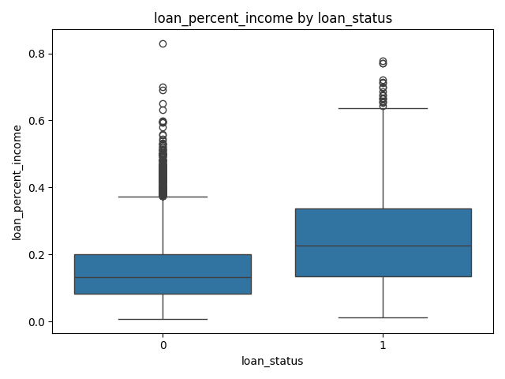
### cb_person_cred_hist_length by loan_status
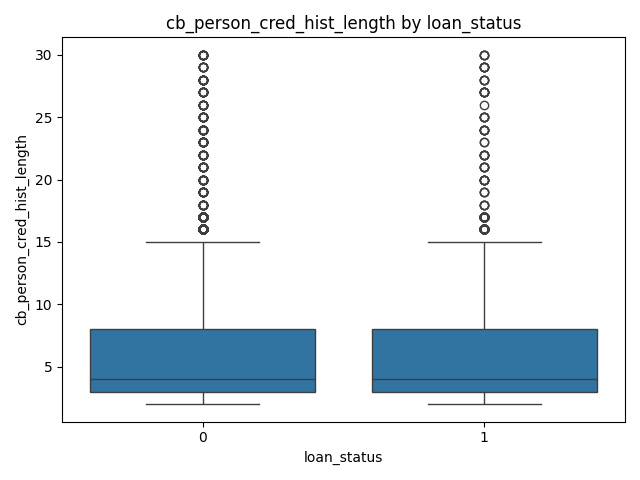
## 7. Correlation Analysis
### Correlation Matrix
                            person_age  person_income  person_emp_length  loan_amnt  loan_int_rate  loan_status  loan_percent_income  cb_person_cred_hist_length
person_age                    1.000000       0.080263           0.156955   0.029377       0.006415    -0.023015            -0.031150                    0.876787
person_income                 0.080263       1.000000           0.189245   0.326363      -0.063377    -0.280269            -0.404127                    0.056898
person_emp_length             0.156955       0.189245           1.000000   0.086268      -0.069680    -0.091812            -0.064815                    0.136344
loan_amnt                     0.029377       0.326363           0.086268   1.000000       0.083213     0.084030             0.626614                    0.021706
loan_int_rate                 0.006415      -0.063377          -0.069680   0.083213       1.000000     0.312477             0.099862                    0.012138
loan_status                  -0.023015      -0.280269          -0.091812   0.084030       0.312477     1.000000             0.375826                   -0.016836
loan_percent_income          -0.031150      -0.404127          -0.064815   0.626614       0.099862     0.375826             1.000000                   -0.019844
cb_person_cred_hist_length    0.876787       0.056898           0.136344   0.021706       0.012138    -0.016836            -0.019844                    1.000000
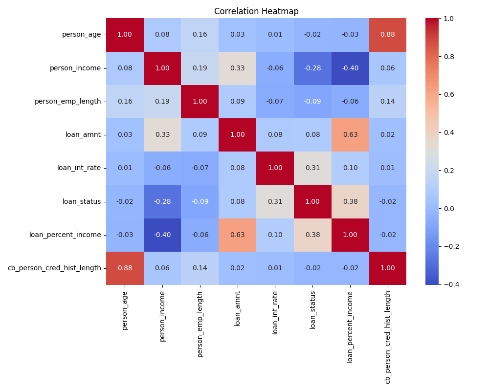
## 8. Outlier Detection
                   feature  count percent
                person_age   1299   4.39%
             person_income    460   1.55%
         person_emp_length    702   2.37%
                 loan_amnt      0   0.00%
             loan_int_rate     33   0.11%
               loan_status   6378  21.56%
       loan_percent_income    663   2.24%
cb_person_cred_hist_length    987   3.34%
